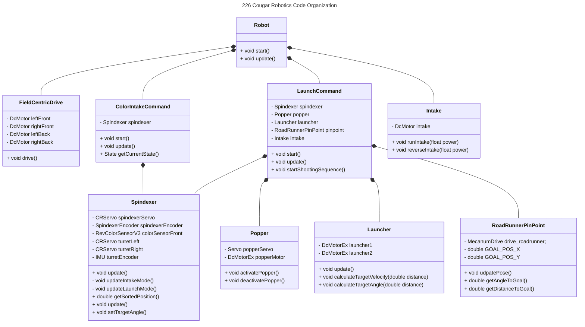

```mermaid
---
title: 226 Cougar Robotics Code Organization
---
classDiagram
class Robot {
    + void start()
    + void update()
}
class ColorIntakeCommand {
    - Spindexer spindexer
    + void start()
    + void update()
    + State getCurrentState()
}
class LaunchCommand {
    - Spindexer spindexer
    - Popper popper
    - Launcher launcher
    - RoadRunnerPinPoint pinpoint
    - Intake intake
    + void start()
    + void update()
    + void startShootingSequence()
}
class FieldCentricDrive {
    - DcMotor leftFront
    - DcMotor rightFront
    - DcMotor leftBack
    - DcMotor rightBack
    + void drive()
}
class Intake {
    - DcMotor intake
    + void runIntake(float power)
    + void reverseIntake(float power)
}
class Launcher{
    - DcMotorEx launcher1
    - DcMotorEx launcher2
    + void update()
    + void calculateTargetVelocity(double distance)
    + void calculateTargetAngle(double distance)
}
class Popper{
    - Servo popperServo
    - DcMotorEx popperMotor
    + void activatePopper()
    + void deactivatePopper()
}
class Spindexer{
    - CRServo spindexerServo
    - SpindexerEncoder spindexerEncoder
    - RevColorSensorV3 colorSensorFront
    + void update()
    - void updateIntakeMode()
    - void updateLaunchMode()
    + double getSortedPosition()
}

class Spindexer{
    - CRServo turretLeft
    - CRServo turretRight
    - IMU turretEncoder
    + void update()
    + void setTargetAngle()
}

class RoadRunnerPinPoint{
    - MecanumDrive drive_roadrunner;
    - double GOAL_POS_X
    - double GOAL_POS_Y
    + void udpatePose()
    + double getAngleToGoal()
    + double getDistanceToGoal()
}

Robot *-- FieldCentricDrive
Robot *-- ColorIntakeCommand
Robot *-- LaunchCommand
Robot *-- Intake
LaunchCommand *-- Spindexer
LaunchCommand *-- Popper
LaunchCommand *-- Launcher
LaunchCommand *-- RoadRunnerPinPoint
ColorIntakeCommand *-- Spindexer
```
